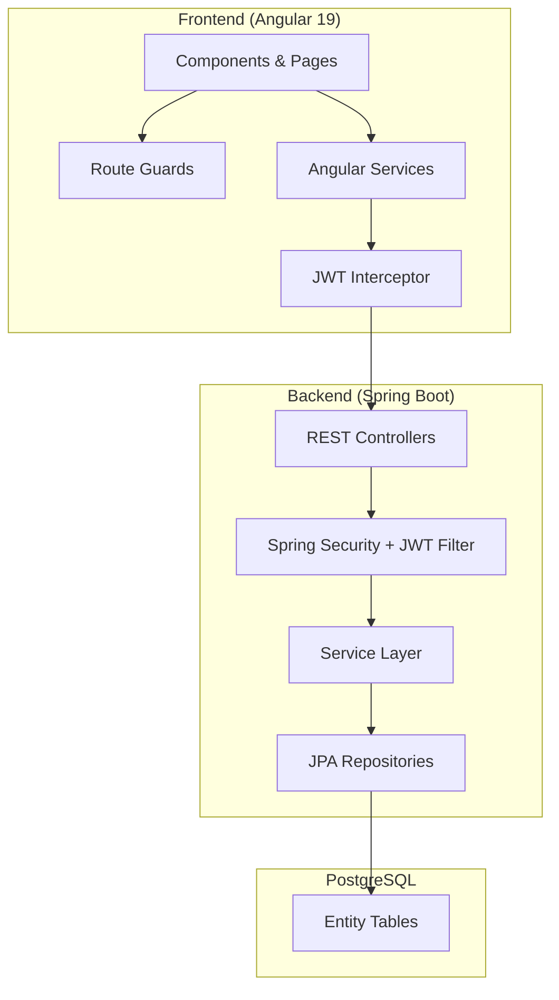
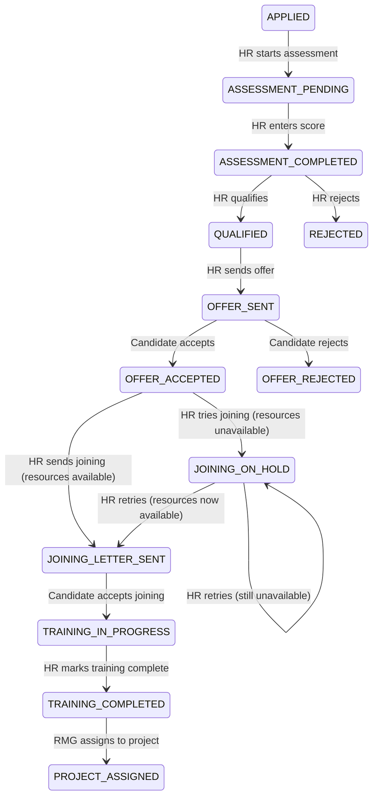
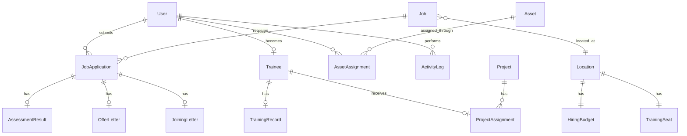
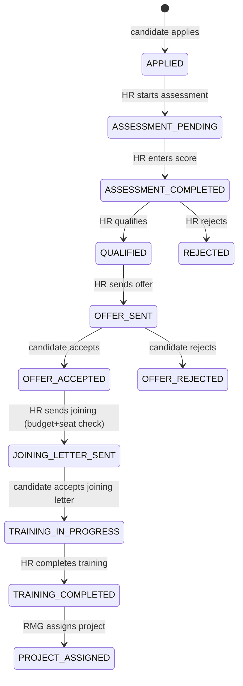

# nexHIRE Design Document

## Overview

nexHIRE is a full-stack HRMS application implementing an employee onboarding pipeline. The system uses a Spring Boot REST API backend with PostgreSQL persistence and an Angular 19 SPA frontend. Authentication is JWT-based with role-based access control (RBAC) enforcing four roles: ADMIN, HR, RMG, and EMPLOYEE. Candidates and trainees are EMPLOYEE-role users distinguished by their `lifecycleStatus` field.

The architecture follows a layered backend pattern (Controller → Service → Repository → Entity) with DTOs for API communication, and a modular Angular frontend with route guards, HTTP interceptors, and role-based component rendering.

## Architecture



### Backend Package Structure

```
backend/
├── src/main/java/com/nexhire/
│   ├── NexhireApplication.java
│   ├── config/
│   │   ├── SecurityConfig.java
│   │   ├── CorsConfig.java
│   │   └── JwtConfig.java
│   ├── security/
│   │   ├── JwtTokenProvider.java
│   │   ├── JwtAuthenticationFilter.java
│   │   └── CustomUserDetailsService.java
│   ├── controller/
│   ├── service/
│   ├── repository/
│   ├── entity/
│   ├── dto/
│   ├── enums/
│   │   ├── UserRole.java
│   │   ├── LifecycleStatus.java
│   │   └── ApplicationStatus.java
│   ├── exception/
│   └── seed/
│       └── DataSeeder.java
├── src/main/resources/
│   └── application.yml
└── pom.xml
```

### Frontend Structure

```
frontend/
├── src/app/
│   ├── app.component.ts
│   ├── app.routes.ts
│   ├── core/
│   │   ├── guards/
│   │   │   ├── auth.guard.ts
│   │   │   └── role.guard.ts
│   │   ├── interceptors/
│   │   │   └── jwt.interceptor.ts
│   │   ├── services/
│   │   │   ├── auth.service.ts
│   │   │   └── api.service.ts
│   │   └── models/
│   ├── shared/
│   │   ├── components/
│   │   │   ├── sidebar/
│   │   │   ├── status-badge/
│   │   │   └── data-table/
│   │   └── layouts/
│   │       └── dashboard-layout/
│   ├── features/
│   │   ├── auth/
│   │   │   ├── login/
│   │   │   └── register/
│   │   ├── employee/
│   │   ├── hr/
│   │   ├── rmg/
│   │   └── admin/
│   └── environments/
├── angular.json
└── package.json
```

## Components and Interfaces

### Backend REST API Endpoints

#### Authentication (`/api/auth`)

| Method | Endpoint             | Role   | Description                                                 |
| ------ | -------------------- | ------ | ----------------------------------------------------------- |
| POST   | `/api/auth/register` | PUBLIC | Candidate registration (role=EMPLOYEE, lifecycle=CANDIDATE) |
| POST   | `/api/auth/login`    | PUBLIC | User login, returns JWT + role + lifecycleStatus            |

#### Jobs (`/api/jobs`)

| Method | Endpoint         | Role         | Description          |
| ------ | ---------------- | ------------ | -------------------- |
| GET    | `/api/jobs`      | EMPLOYEE     | List active jobs     |
| POST   | `/api/jobs`      | HR           | Create a job posting |
| GET    | `/api/jobs/{id}` | EMPLOYEE, HR | Get job details      |

#### Applications (`/api/applications`)

| Method | Endpoint                                  | Role     | Description                       |
| ------ | ----------------------------------------- | -------- | --------------------------------- |
| POST   | `/api/applications`                       | EMPLOYEE | Submit job application            |
| GET    | `/api/applications/my`                    | EMPLOYEE | Get own applications              |
| GET    | `/api/applications`                       | HR       | List all applications             |
| GET    | `/api/applications/{id}`                  | HR       | Get application details           |
| PUT    | `/api/applications/{id}/start-assessment` | HR       | Move APPLIED → ASSESSMENT_PENDING |

#### Assessments (`/api/assessments`)

| Method | Endpoint                                   | Role | Description              |
| ------ | ------------------------------------------ | ---- | ------------------------ |
| POST   | `/api/assessments/{applicationId}`         | HR   | Enter assessment score   |
| POST   | `/api/assessments/upload-csv`              | HR   | Bulk upload via CSV      |
| PUT    | `/api/assessments/{applicationId}/qualify` | HR   | Mark candidate qualified |
| PUT    | `/api/assessments/{applicationId}/reject`  | HR   | Mark candidate rejected  |

#### Offer Letters (`/api/offers`)

| Method | Endpoint                      | Role     | Description                         |
| ------ | ----------------------------- | -------- | ----------------------------------- |
| POST   | `/api/offers/{applicationId}` | HR       | Send offer letter (no budget check) |
| GET    | `/api/offers/my`              | EMPLOYEE | Get own offer letters               |
| PUT    | `/api/offers/{id}/accept`     | EMPLOYEE | Accept offer                        |
| PUT    | `/api/offers/{id}/reject`     | EMPLOYEE | Reject offer                        |

#### Joining Letters (`/api/joining-letters`)

| Method | Endpoint                               | Role     | Description                                              |
| ------ | -------------------------------------- | -------- | -------------------------------------------------------- |
| POST   | `/api/joining-letters/{applicationId}` | HR       | Send joining letter (checks budget + seats)              |
| GET    | `/api/joining-letters/my`              | EMPLOYEE | Get own joining letters                                  |
| PUT    | `/api/joining-letters/{id}/accept`     | EMPLOYEE | Accept joining letter (becomes trainee, starts training) |

#### Location Budget & Seats (`/api/locations`)

| Method | Endpoint              | Role | Description                          |
| ------ | --------------------- | ---- | ------------------------------------ |
| GET    | `/api/locations`      | HR   | List locations with budget/seat info |
| PUT    | `/api/locations/{id}` | HR   | Update budget/seat configuration     |

#### Training (`/api/training`)

| Method | Endpoint                             | Role     | Description                          |
| ------ | ------------------------------------ | -------- | ------------------------------------ |
| GET    | `/api/training/trainees`             | HR       | List all trainees                    |
| GET    | `/api/training/my`                   | EMPLOYEE | Get own training record (if trainee) |
| PUT    | `/api/training/{traineeId}/progress` | HR       | Update training progress             |
| PUT    | `/api/training/{traineeId}/complete` | HR       | Mark training complete               |

#### Projects & Assignment (`/api/projects`)

| Method | Endpoint                                       | Role | Description                      |
| ------ | ---------------------------------------------- | ---- | -------------------------------- |
| GET    | `/api/projects`                                | RMG  | List available projects          |
| POST   | `/api/projects`                                | RMG  | Create project                   |
| GET    | `/api/projects/eligible-trainees`              | RMG  | List training-completed trainees |
| POST   | `/api/projects/{projectId}/assign/{traineeId}` | RMG  | Assign trainee to project        |

#### Users (`/api/users`)

| Method | Endpoint                     | Role  | Description      |
| ------ | ---------------------------- | ----- | ---------------- |
| GET    | `/api/users`                 | ADMIN | List all users   |
| PUT    | `/api/users/{id}/role`       | ADMIN | Update user role |
| PUT    | `/api/users/{id}/deactivate` | ADMIN | Deactivate user  |

#### Roles (`/api/roles`)

| Method | Endpoint     | Role  | Description    |
| ------ | ------------ | ----- | -------------- |
| GET    | `/api/roles` | ADMIN | List all roles |

#### Assets (`/api/assets`)

| Method | Endpoint                                | Role  | Description                |
| ------ | --------------------------------------- | ----- | -------------------------- |
| GET    | `/api/assets`                           | ADMIN | List all assets            |
| POST   | `/api/assets`                           | ADMIN | Create asset               |
| POST   | `/api/assets/{assetId}/assign/{userId}` | ADMIN | Assign asset to user       |
| PUT    | `/api/assets/assignments/{id}/revoke`   | ADMIN | Revoke asset               |
| GET    | `/api/assets/user/{userId}`             | ADMIN | Get user asset assignments |

#### Activity Logs (`/api/activity-logs`)

| Method | Endpoint             | Role  | Description        |
| ------ | -------------------- | ----- | ------------------ |
| GET    | `/api/activity-logs` | ADMIN | List activity logs |

### Role Permissions Matrix

| Feature               | ADMIN | HR  | RMG | EMPLOYEE (Candidate/Trainee) |
| --------------------- | ----- | --- | --- | ---------------------------- |
| Register              | -     | -   | -   | ✓ (public)                   |
| Login                 | ✓     | ✓   | ✓   | ✓                            |
| View Jobs             | -     | ✓   | -   | ✓                            |
| Create Jobs           | -     | ✓   | -   | -                            |
| Apply for Jobs        | -     | -   | -   | ✓ (lifecycle=CANDIDATE)      |
| Start Assessment      | -     | ✓   | -   | -                            |
| Manage Assessments    | -     | ✓   | -   | -                            |
| Send Offer Letters    | -     | ✓   | -   | -                            |
| Accept/Reject Offer   | -     | -   | -   | ✓                            |
| Send Joining Letters  | -     | ✓   | -   | -                            |
| Accept Joining Letter | -     | -   | -   | ✓                            |
| View Budgets/Seats    | -     | ✓   | -   | -                            |
| Manage Training       | -     | ✓   | -   | ✓ (view own only)            |
| Manage Projects       | -     | -   | ✓   | -                            |
| Assign Trainees       | -     | -   | ✓   | -                            |
| Manage Users          | ✓     | -   | -   | -                            |
| Manage Roles          | ✓     | -   | -   | -                            |
| Manage Assets         | ✓     | -   | -   | -                            |
| View Activity Logs    | ✓     | -   | -   | -                            |

## Data Models

### Enum Definitions

#### UserRole

```
ADMIN, HR, RMG, EMPLOYEE
```

#### LifecycleStatus

```
CANDIDATE, TRAINEE, PROJECT_ASSIGNED
```

#### ApplicationStatus

```
APPLIED, ASSESSMENT_PENDING, ASSESSMENT_COMPLETED, QUALIFIED, REJECTED,
OFFER_SENT, OFFER_ACCEPTED, OFFER_REJECTED, JOINING_ON_HOLD, JOINING_LETTER_SENT,
TRAINING_IN_PROGRESS, TRAINING_COMPLETED, PROJECT_ASSIGNED
```

### Application Status State Machine



### Entity Relationship Diagram



### Entity Definitions

#### User

| Field           | Type                   | Constraints                       |
| --------------- | ---------------------- | --------------------------------- |
| id              | Long                   | PK, auto-generated                |
| name            | String                 | NOT NULL                          |
| email           | String                 | NOT NULL, UNIQUE                  |
| password        | String                 | NOT NULL (BCrypt hashed)          |
| phone           | String                 | NOT NULL                          |
| role            | UserRole (enum)        | NOT NULL                          |
| lifecycleStatus | LifecycleStatus (enum) | NULLABLE (only for EMPLOYEE role) |
| active          | Boolean                | NOT NULL, default true            |
| createdAt       | Timestamp              | NOT NULL                          |
| updatedAt       | Timestamp              | NOT NULL                          |

#### Job

| Field        | Type          | Constraints            |
| ------------ | ------------- | ---------------------- |
| id           | Long          | PK, auto-generated     |
| title        | String        | NOT NULL               |
| description  | String        | NOT NULL               |
| requirements | String        |                        |
| location     | Location (FK) | NOT NULL               |
| active       | Boolean       | NOT NULL, default true |
| createdAt    | Timestamp     | NOT NULL               |

#### JobApplication

| Field             | Type                     | Constraints        |
| ----------------- | ------------------------ | ------------------ |
| id                | Long                     | PK, auto-generated |
| user              | User (FK)                | NOT NULL           |
| job               | Job (FK)                 | NOT NULL           |
| status            | ApplicationStatus (enum) | NOT NULL           |
| appliedAt         | Timestamp                | NOT NULL           |
| updatedAt         | Timestamp                | NOT NULL           |
| UNIQUE(user, job) |                          |                    |

#### AssessmentResult

| Field       | Type                | Constraints                 |
| ----------- | ------------------- | --------------------------- |
| id          | Long                | PK, auto-generated          |
| application | JobApplication (FK) | NOT NULL, UNIQUE            |
| score       | Double              | NOT NULL                    |
| remarks     | String              |                             |
| evaluatedBy | User (FK)           | NOT NULL (derived from JWT) |
| evaluatedAt | Timestamp           | NOT NULL                    |

#### OfferLetter

| Field       | Type                | Constraints                 |
| ----------- | ------------------- | --------------------------- |
| id          | Long                | PK, auto-generated          |
| application | JobApplication (FK) | NOT NULL, UNIQUE            |
| content     | String              | NOT NULL                    |
| sentBy      | User (FK)           | NOT NULL (derived from JWT) |
| sentAt      | Timestamp           | NOT NULL                    |
| respondedAt | Timestamp           |                             |

#### JoiningLetter

| Field       | Type                | Constraints                 |
| ----------- | ------------------- | --------------------------- |
| id          | Long                | PK, auto-generated          |
| application | JobApplication (FK) | NOT NULL, UNIQUE            |
| content     | String              | NOT NULL                    |
| joiningDate | Date                | NOT NULL                    |
| location    | Location (FK)       | NOT NULL                    |
| sentBy      | User (FK)           | NOT NULL (derived from JWT) |
| sentAt      | Timestamp           | NOT NULL                    |
| respondedAt | Timestamp           |                             |

#### Location

| Field | Type   | Constraints        |
| ----- | ------ | ------------------ |
| id    | Long   | PK, auto-generated |
| name  | String | NOT NULL, UNIQUE   |
| city  | String | NOT NULL           |

#### HiringBudget

| Field      | Type          | Constraints         |
| ---------- | ------------- | ------------------- |
| id         | Long          | PK, auto-generated  |
| location   | Location (FK) | NOT NULL, UNIQUE    |
| totalSlots | Integer       | NOT NULL            |
| usedSlots  | Integer       | NOT NULL, default 0 |

#### TrainingSeat

| Field         | Type          | Constraints         |
| ------------- | ------------- | ------------------- |
| id            | Long          | PK, auto-generated  |
| location      | Location (FK) | NOT NULL, UNIQUE    |
| totalSeats    | Integer       | NOT NULL            |
| occupiedSeats | Integer       | NOT NULL, default 0 |

#### Trainee

| Field       | Type                | Constraints        |
| ----------- | ------------------- | ------------------ |
| id          | Long                | PK, auto-generated |
| user        | User (FK)           | NOT NULL, UNIQUE   |
| application | JobApplication (FK) | NOT NULL, UNIQUE   |
| joinedAt    | Timestamp           | NOT NULL           |

#### TrainingRecord

| Field     | Type         | Constraints             |
| --------- | ------------ | ----------------------- |
| id        | Long         | PK, auto-generated      |
| trainee   | Trainee (FK) | NOT NULL, UNIQUE        |
| progress  | Integer      | NOT NULL (0-100)        |
| topic     | String       |                         |
| completed | Boolean      | NOT NULL, default false |
| updatedAt | Timestamp    | NOT NULL                |

#### Project

| Field       | Type      | Constraints            |
| ----------- | --------- | ---------------------- |
| id          | Long      | PK, auto-generated     |
| name        | String    | NOT NULL               |
| description | String    |                        |
| active      | Boolean   | NOT NULL, default true |
| teamSize    | Integer   | NOT NULL, default 0    |
| createdAt   | Timestamp | NOT NULL               |

#### ProjectAssignment

| Field      | Type         | Constraints                 |
| ---------- | ------------ | --------------------------- |
| id         | Long         | PK, auto-generated          |
| trainee    | Trainee (FK) | NOT NULL, UNIQUE            |
| project    | Project (FK) | NOT NULL                    |
| assignedBy | User (FK)    | NOT NULL (derived from JWT) |
| assignedAt | Timestamp    | NOT NULL                    |

#### Asset

| Field        | Type   | Constraints        |
| ------------ | ------ | ------------------ |
| id           | Long   | PK, auto-generated |
| name         | String | NOT NULL           |
| type         | String | NOT NULL           |
| serialNumber | String | UNIQUE             |

#### AssetAssignment

| Field      | Type       | Constraints            |
| ---------- | ---------- | ---------------------- |
| id         | Long       | PK, auto-generated     |
| asset      | Asset (FK) | NOT NULL               |
| user       | User (FK)  | NOT NULL               |
| assignedAt | Timestamp  | NOT NULL               |
| revokedAt  | Timestamp  |                        |
| active     | Boolean    | NOT NULL, default true |

#### ActivityLog

| Field       | Type      | Constraints        |
| ----------- | --------- | ------------------ |
| id          | Long      | PK, auto-generated |
| user        | User (FK) | NOT NULL           |
| actionType  | String    | NOT NULL           |
| description | String    | NOT NULL           |
| timestamp   | Timestamp | NOT NULL           |

### State Transition Rules



Valid transitions (enforced by backend):

- APPLIED → ASSESSMENT_PENDING
- ASSESSMENT_PENDING → ASSESSMENT_COMPLETED
- ASSESSMENT_COMPLETED → QUALIFIED | REJECTED
- QUALIFIED → OFFER_SENT
- OFFER_SENT → OFFER_ACCEPTED | OFFER_REJECTED
- OFFER_ACCEPTED → JOINING_LETTER_SENT (requires budget + seat check)
- JOINING_LETTER_SENT → TRAINING_IN_PROGRESS (candidate accepts joining; creates Trainee + TrainingRecord)
- TRAINING_IN_PROGRESS → TRAINING_COMPLETED
- TRAINING_COMPLETED → PROJECT_ASSIGNED

## Correctness Properties

_A property is a characteristic or behavior that should hold true across all valid executions of a system-essentially, a formal statement about what the system should do. Properties serve as the bridge between human-readable specifications and machine-verifiable correctness guarantees._

### Property 1: Registration produces correct defaults

_For any_ valid registration input (name, email, password, phone), the created user SHALL have role=EMPLOYEE, lifecycleStatus=CANDIDATE, active=true, and the stored password SHALL be a BCrypt hash that verifies against the original plaintext.
**Validates: Requirements 1.1, 1.5**

### Property 2: JWT token contains correct identity

_For any_ registered user with valid credentials, logging in SHALL produce a JWT token whose payload contains the user's current role and user ID matching the database record.
**Validates: Requirements 1.2**

### Property 3: Active job filtering

_For any_ set of jobs in the database (mix of active=true and active=false), the job listing endpoint SHALL return exactly and only the jobs where active=true.
**Validates: Requirements 2.1**

### Property 4: Application ownership isolation

_For any_ EMPLOYEE-role user, querying their applications SHALL return exactly and only the applications belonging to that user, regardless of how many other users have applications in the system.
**Validates: Requirements 2.4**

### Property 5: State machine transition validity

_For any_ job application in any ApplicationStatus, the system SHALL accept only the transitions defined in the valid transition set and reject all other status changes with HTTP 400. Valid transitions: APPLIED→ASSESSMENT_PENDING, ASSESSMENT_PENDING→ASSESSMENT_COMPLETED, ASSESSMENT_COMPLETED→QUALIFIED|REJECTED, QUALIFIED→OFFER_SENT, OFFER_SENT→OFFER_ACCEPTED|OFFER_REJECTED, OFFER_ACCEPTED→JOINING_LETTER_SENT, JOINING_LETTER_SENT→TRAINING_IN_PROGRESS, TRAINING_IN_PROGRESS→TRAINING_COMPLETED, TRAINING_COMPLETED→PROJECT_ASSIGNED.
**Validates: Requirements 3.1, 3.4, 3.5, 4.1, 4.3, 4.4, 12.4**

### Property 6: CSV parse summary consistency

_For any_ CSV file with N rows of assessment data (some valid, some invalid), the returned summary SHALL satisfy successCount + failureCount = N, and exactly successCount records SHALL be persisted.
**Validates: Requirements 3.3**

### Property 7: Joining letter resource decrement

_For any_ location with B available budget slots and S available training seats before a joining letter is sent, the budget after SHALL be B-1 and seats after SHALL be S-1.
**Validates: Requirements 5.2, 6.2**

### Property 8: Budget arithmetic consistency

_For any_ location, the remaining hiring budget SHALL equal totalSlots - usedSlots, and remaining training seats SHALL equal totalSeats - occupiedSeats.
**Validates: Requirements 6.1**

### Property 9: Joining acceptance creates trainee with correct state

_For any_ candidate who accepts a joining letter (applicationStatus=JOINING_LETTER_SENT), the system SHALL update applicationStatus to TRAINING_IN_PROGRESS, set lifecycleStatus to TRAINEE, create a Trainee record linked to the user and application, and create a TrainingRecord with progress=0 and completed=false.
**Validates: Requirements 5.4**

### Property 10: Training progress persistence

_For any_ trainee and any progress value P (0 ≤ P ≤ 100), updating training progress SHALL result in the training record reflecting exactly value P.
**Validates: Requirements 7.1**

### Property 11: Project assignment transitions

_For any_ trainee with applicationStatus TRAINING_COMPLETED assigned to an active project, the system SHALL create a ProjectAssignment record, set applicationStatus to PROJECT_ASSIGNED, and update user lifecycleStatus to PROJECT_ASSIGNED.
**Validates: Requirements 8.2**

### Property 12: Eligible trainee filtering

_For any_ set of trainees in various statuses, the eligible-trainees endpoint SHALL return exactly those whose applicationStatus is TRAINING_COMPLETED.
**Validates: Requirements 8.1**

### Property 13: Asset assignment lifecycle

_For any_ asset assigned to a user, the assignment SHALL have active=true. After revocation, active=false with revokedAt set. Querying returns correct active/historical partition.
**Validates: Requirements 10.1, 10.2, 10.3**

### Property 14: Activity log ordering

_For any_ set of activity log entries, retrieval SHALL return them sorted by timestamp in descending order.
**Validates: Requirements 11.1**

### Property 15: Significant actions produce log entries

_For any_ significant action (login, status change, role change, asset assignment, assessment initiation), the activity log count SHALL increase by exactly one with correct user ID, action type, and timestamp.
**Validates: Requirements 11.2**

### Property 16: Unauthenticated request rejection

_For any_ protected API endpoint, a request without a valid JWT token SHALL receive HTTP 401.
**Validates: Requirements 12.1**

### Property 17: Role-based access enforcement

_For any_ API endpoint with role restrictions, a request with a valid JWT for a non-authorized role SHALL receive HTTP 403.
**Validates: Requirements 12.2**

### Property 18: Sensitive field immunity

_For any_ request body containing userId, role, lifecycleStatus, applicationStatus, evaluator, assignedBy, or sentBy fields with spoofed values, the backend SHALL ignore those values and derive them from the JWT context.
**Validates: Requirements 12.3**

### Property 19: DTO serialization round-trip

_For any_ valid response DTO object, serializing to JSON and deserializing back SHALL produce an equivalent object with camelCase field names.
**Validates: Requirements 14.1, 14.2**

### Property 20: Role-based navigation menu filtering

_For any_ user role, the navigation menu items returned SHALL contain only items authorized for that role and exclude all unauthorized items.
**Validates: Requirements 13.1**

## Error Handling

### Backend Error Handling Strategy

Global exception handler (`@ControllerAdvice`) maps exceptions to standardized error responses:

| Exception                         | HTTP Status | Description                  |
| --------------------------------- | ----------- | ---------------------------- |
| `ResourceNotFoundException`       | 404         | Entity not found             |
| `DuplicateResourceException`      | 409         | Duplicate email, application |
| `InvalidStateTransitionException` | 400         | Invalid status change        |
| `InsufficientResourceException`   | 400         | Budget/seat exhausted        |
| `ValidationException`             | 400         | DTO validation failures      |
| `AuthenticationException`         | 401         | Invalid credentials          |
| `AccessDeniedException`           | 403         | Role not authorized          |

### Error Response Format

```json
{
  "timestamp": "2026-07-06T10:30:00Z",
  "status": 400,
  "error": "Bad Request",
  "message": "Cannot transition from APPLIED to QUALIFIED",
  "path": "/api/assessments/5/qualify"
}
```

### Frontend Error Handling

- HTTP interceptor catches 401 → redirects to login
- HTTP interceptor catches 403 → shows "unauthorized" toast
- Form validation shows inline errors before submission

## Testing Strategy

### Testing Framework

- **JUnit 5** for test structure and assertions
- **Mockito** for mocking dependencies in service layer tests
- **Spring Boot Test** + **MockMvc** for controller/integration tests
- **Angular Jasmine/Karma** for frontend component tests

### Backend Testing Approach

Service layer tests using Mockito:

- `AuthServiceTest` — registration defaults, BCrypt hashing, login token generation
- `ApplicationServiceTest` — state transitions, duplicate rejection, ownership
- `AssessmentServiceTest` — score entry, CSV parsing, qualify/reject validation
- `OfferServiceTest` — offer send validation, accept/reject
- `JoiningLetterServiceTest` — budget+seat check, decrement, trainee creation
- `TrainingServiceTest` — progress update, completion logic
- `ProjectAssignmentServiceTest` — eligibility check, assignment logic

Controller tests using MockMvc:

- Authentication endpoints (register/login)
- Role-based access verification
- Invalid request handling

### Test Priority Order

1. Application compiles and runs
2. JWT authentication works
3. Role-based authorization works
4. State machine transitions are correct
5. Budget/seat resource management works
6. End-to-end onboarding demo works
7. Mockito tests exist for important service-layer logic

### Property-Based Testing (Deferred)

Property-based testing with jqwik is deferred to a later phase. The correctness properties documented above serve as the specification for future PBT implementation. For the MVP, Mockito-based tests verify the same properties through representative examples.

## Assumptions

1. No separate CANDIDATE or TRAINEE roles — these are lifecycle statuses of EMPLOYEE-role users
2. Offer letters do NOT require budget/seat checks — only joining letters do
3. Budget and seat checks happen together when sending joining letters
4. One user can apply to multiple jobs, each application has independent status flow
5. Git operations are manual — the system does not auto-commit
6. CSV assessment upload is simple (applicationId, score, remarks columns)
7. Training progress is a single 0-100 integer per trainee
8. Asset assignment is one-to-many (one user can have multiple active assets)
9. Activity logging is fire-and-forget (does not block the main operation)
10. The frontend uses Angular standalone components (Angular 19 default)
